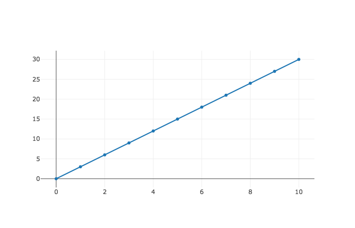
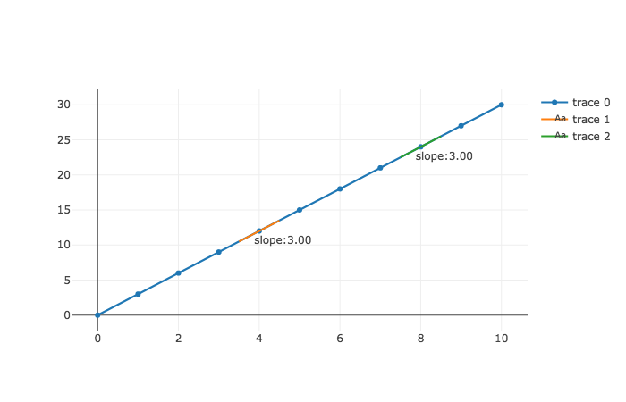

# Introduction to Derivatives

### Learning objectives

* Understand that derivatives are the instantaneous rate of change of a function
* Understand how to calculate a derivative 
* Understand how to express taking a derivative at a given point, and evaluating a function at a given point mathematically

### Introduction

In the lesson discussing step sizes of our gradient descent algorithm, we filled in some more information on how to find "best fit" regression line with using gradient descent.  Namely, we learned how to more carefully change the y-intercept of the regression line to minimize the residual sum of squares.  We did this by calibrating the size and direction of of our change in $b$ to the slope of the line tangent to the cost curve at that value of $b$. By tangent line, we mean a line that "just touches" our curve at a given point.  So below, our orange, green, and red lines are each tangent to the curve at their respective points.

With our gradient descent algorithm, the larger the absolute value of the slope, the larger our change in $b$ -- that is, the larger our step size.  So we take a much larger step when our slope is -146.17 at $b = 70$ than we do when our slope equals -58.51 at $b = 85$.

While we know our gradient descent technique depends on changing our values according to the slope of our cost curve, we do not know how to find that slope at a given point.  In this lesson, we'll learn how to calculate this slope.

## Talking about derivatives

The slope of a line tangent to the function at that point is called the derivative.  Or equivalently, the **derivative** is defined as the instantaneous rate of change of a function.  This makes sense.  The  more our function is changing, the larger the magnitude of our slope at a given point.

> For these purposes, magnitude describes the absolute value of a number.  We use it because it's not accurate to say that -100 is larger than -99.  After all, -100 is more negative and thus *smaller* than -99.  But it is correct to say that the magnitude of -100 is larger than the magnitude of -99, as absolute value of -100 equals 100 and the absolute value of -99 is 99.   

So a derivative answers questions about change.  If you look at our blue curve above, the various slopes indicate how much is our output changing (in this case, our RSS) as we increase our input (here, our value of $b$).  At the point $b = 70$, the cost curve is decreasing a lot.  At the point, $b = 90$ the cost curve is still decreasing, but significantly less.  Thus at both $b = 90$ and $b = 70$ the derivative is negative as the change to cost is downward.  But the magnitude of change at the two points varies: when $b = 70 $, the derivative is -146.17 and when $b = 90$ the derivative is -21.07.

Ok, so the derivative of a function is the rate of change of a function.  But how do we calculate the rate of change of a function?

### Calculating the derivative

Remember from our previous lesson that $f(3)$ means evaluate the function when $x = 3$.  Well $f'(3)$ means (read as f prime of 3) means evaluate the derivative of the function when $x$ equals $3$.  Or to put it another way, evaluate the instantaneous rate of change of a function when $x$ equals $3$.  Or to put it yet another way, evaluate the slope of the tangent line of the function when $x = 3$.  We do that by writing $f'(3)$.

Ok, so now how do we calculate the instantaneous rate of change of our function, $f(x) = 3*x$?  First, let's see that function graphically. 

Ok to measure $f'(3)$ we are measuring the rate of change at $f(3)$.  

The way we can calculate the rate of change at $f(3)$ is to see the output at $f(3)$, and then increase our value of $x$ to $x = 5$, and evaluate $f(5)$.  Now we see how large the change in output was over that amount.  The rate of change is simply our change in output divided by the change in output. 

To translate this to math we can express this as: 

$$f'(3) = \frac{f(5) - f(3)}{5 - 3}$$

Now plugging in values we have $f(5) = 15$ and $f(3) = 9 $ so we have:

$$\frac {15 - 9}{5 - 2} = \frac{6}{2} = 3$$

If you think about it, it makes sense that the rate of change of a function $f(x) = 3x $ is 3.  For every unit of $x$ that we increase, the output, $f(x)$ increases by 3.  Looking at our line again, we can see this graphically.  Regardless of where we are evaluating the slope of the tangent line, for this function, that slope is always 3.

So that's how we calculate the derivative.  Derivative is simply the rate of change.  So we see how much the output changes per a change in a given input.  Expressed mathematically, our formula for calculating the derivative looks like this:

$$ f'(x) = \frac{f(x + h) - f(x)}{h}$$ 

Take some time to take in this formula.  It's not going away.  This formula encapsulates our earlier approach. In our above approach, we let $h = 2$.  Then we calculated $$f'(3) = \frac{f(3 + h) - f(3)}{h} =  \frac{f(3 + 2) - f(3)}{2} = \frac{f(5) - f(3)}{2} = \frac{15 - 9}{2} = 3$$  

Another word for $h$ is delta, or $\Delta $ or $\Delta x $.  Delta just means change, and $\Delta $ is the Greek capital letter delta.  And we say $\Delta x $ because that is what we are changing, $x$.  Similarly, the change in output is sometimes expressed as $\Delta f $.  So another way of writing our function is: 

$$ f'(x) = \frac{\Delta f}{\Delta x}$$

The derivative of a function $f(x)$ is the change in the output over the change in the input, $x$.

### Derivatives of non-linear functions

But things quickly becomes trickier when working with more complicated functions.  And we will run into these functions.  For example, let's consider how to take the derivative of something resembles our cost curve.  After all, figuring out the slope at a given point of a cost curve is what led us here.

This is the graph of the function $f(x) = (300*x - 300)^2 $.  How do we take the derivative when our function looks like this? Let's start by using our earlier technique to calculate the derivative at the point $x = 0$.  So we evaluate $f(0)$ and we evaluate our function at a little more than zero, say $f(1)$, so we let $h = 1$.  Ok let's do it:

$$ f'(x) = \frac{f(x + h) - f(x)}{h} $$ 

$$ f'(0) = \frac{f(0 + h) - f(0)}{h} $$ 

$$ f'(0) = \frac{f(0 + 1) - f(0)}{1} = \frac{f(1) - f(0)}{1}$$ 

Ok, now let's calculate $f(0)$ and $f(1)$ and plug in the values.

$$f(0) = (300*0 - 300)^2 = (-300)^2 =  90,000 $$

$$f(1) = (300*1 - 300)^2 = 0^2 = 0 $$

$$f'(0) = \frac{0 - 90,000}{1- 0} = -90,000 $$

Ok, sweet!  Now let's show a line with this slope where $x = 0$.

Take a close look at the straight line in the graph above.  That straight line is a supposed to have the same slope as the blue curve at the point $x = 0$.  After all, we calculated the derivative at that point, and that gave us a slope of -90000, yet that doesn't seem to be matching the slope of the curve at that value of $x = 0$.

The slope of the straight line should be pointing more downwards.  Where did we go wrong?  Let's take another look at our calculation of the derivative. 

$$f(0) = (300*0 - 300)^2 = (-300)^2 =  90,000 $$

$$f(1) = (300*1 - 300)^2 = 0^2 = 0 $$

$$f'(0) = \frac{0 - 90,000}{1- 0} = -90,000 $$

The problem is that if we calculate change in our output divided by the change in our input, and we set $h = 1$, then we are really calculating the rate of change of the function from zero to one.  

But what we **want** to do is calculate the rate of change at just that point $x = 0$, after all we want the instantanous rate of change - and that is a different matter.  So we can't just calculate our change by checking once, then waiting and checking again later.  Our derivative means we are calculating how fast a function is changing at any given moment, and precisely at that moment.  And unlike in our function of the line $y = 3x $, here the amount that $y$ decreases or increases is always changing.  The larger our value of $h$, the less our derivative reflects the rate of change at just that point. 

So what we need to do is decrease our value of $h$ to such a small number that it is zero.  But it's ludicrous to calculate the amount of change in an output when the change in our input is zero.  When change in our input is zero, it means there is no change.  How can we calculate rate of change at precisely one spot on a curve?  There's no change at all at just one point.  Change happens across multiple points.

So how do we calculate the rate of change of our function across no change in input?  We use our imagination.  Really.  We calculate the derivative with a $\Delta $ of .1, then calculate it again with a $\Delta $ of .01, then again with $\Delta $ .001.  Our derivative calculation should show convergance on a single number as our $\Delta $ approaches zero and that number is our derivative.  

** That is, the derivative of a function is a change in the function's output as h, that is $\Delta x $,  approaches zero **.    

When $\Delta x = 1$ 

When $\Delta x = .1$ 

When $\Delta x = .1$ 

Notice that our curves approach being tangent to the line as we decrease $\Delta x$.  In addition, our slopes converge to one number.  In fact, in decreasing $\Delta x$ we can see a fairly clear pattern.

| $ \Delta x $        | $ \Delta y/\Delta x $|
| ------------- |:-------------:|
| .1      | -171,000      |
| .01 | -179,100     |
| .001 | -179,910      |
| .0001 | -179,991      |

As you can see, as $\Delta x $ approaches zero, $f'(x) $ approaches $ -180,000 $.  This convergance around one number as we change another number, is called the **limit **.  So to describe the above, we would say, at the point $x = 0 $, the limit of $\Delta y \div \Delta x $ -- that is the number $\Delta y \div \Delta x $ approaches -- as  $ \Delta x $ approaches zero is -180,000.  We can abbreviate this into the following expression: 

When $x = 0,\lim_{\Delta x\to0} \Delta y / \Delta x = -180,000  $.

Or, better yet, we can update and correct our definition of derivative to equal:

$$ f'(x) = \lim_{ h\to0} \frac{f(x + h) - f(x)}{h} $$ 

That is our real definition of a derivative, and you best not forget it.

### Summary

In this section, we learned about derivatives.  A derivative is the instantaneous rate of change of a function.  To calculate the instantaneous rate of change of a function, we see the value that $\frac{\Delta y}{\Delta x} $ approaches as $\Delta x $ approaches zero.  This way, we are not calculating the rate of change of a function across a given distance, but rather are finding the rate of change instantaneously. 
