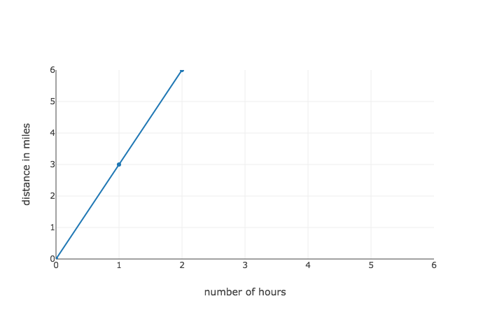
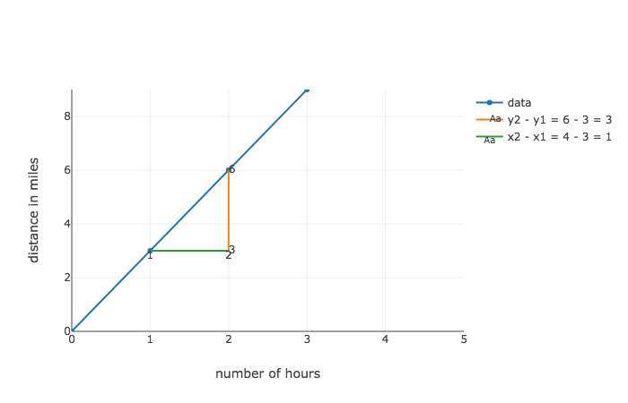
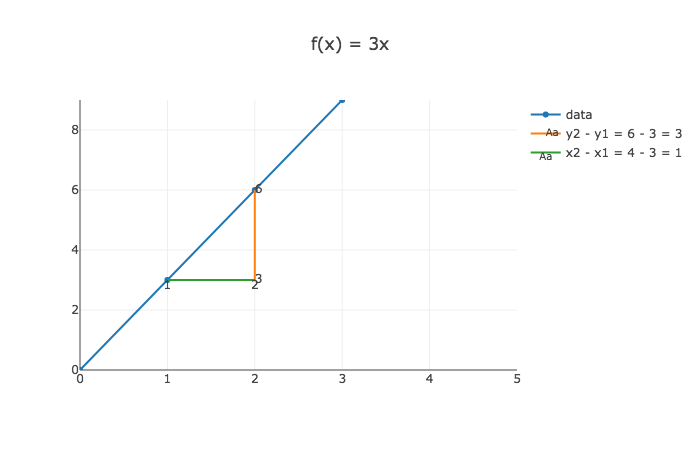
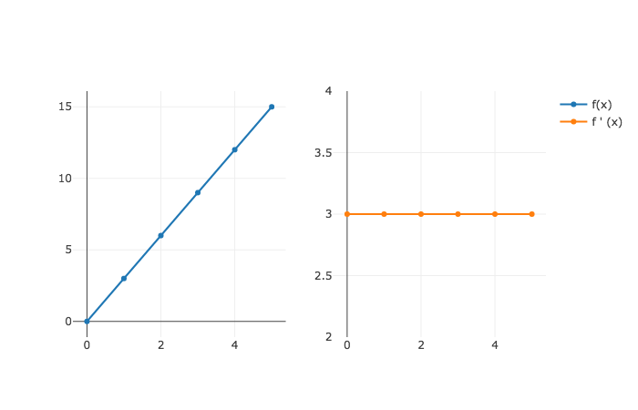

# Derivatives of straight lines

### Learning objectives

- Understand that derivatives are the instantaneous rate of change of a function
- Understand how to calculate a derivative of a straight line

### Introduction

In the lesson discussing step sizes of our gradient descent algorithm, we filled in some more information on how to find "best fit" regression line by using gradient descent.  Namely, we learned how to efficiently change the y-intercept of the regression line to minimize the residual sum of squares.  

We did this by calibrating the size and direction of our change of one regression line parameter -- let's say $b$, our y-intercept -- to the slope of the line tangent to the cost curve at that value of $b$. By tangent line, we mean a line that "just touches" our curve at a given point.  

Below is a curve that shows the RSS of a regression line with different values of $b$.  Our orange, green, and red lines are each tangent to the curve at their respective points.

With our gradient descent algorithm, the larger the absolute value of the slope, the larger the change in our regression line parameter -- that is, the larger our step size.  We take a much larger step when our slope is -146.17 at $b = 70$ than we do when our slope equals -58.51 at $b = 85$.

Here is what **we know so far:**
* How to apply gradient descent by using the slope of the cost curve to determine the direction and magnitude of the next step for updating the parameter of a regression line

Here is **what we need to learn:**
* How to find that slope or rate of change of a function at a given point.  

> The instantaneous rate of change at a given point is called the **derivative**.  

Derivatives are important because they tell us how a function is changing at any given point.  Derivatives allow us to see what is coming next.  

All a derivative means is the instantaneous rate of change of a function.  We already learned how to calculate the derivative of a straight line: it's the rise over the run. The rate of change of a line is constant for all points along the line, therefore the derivative is the same for all of its points.  We'll focus on calculating the derivatives of straight line functions, or linear functions, before moving onto calculating the derivative of curved lines (like our cost curve) in a future lesson.   

### Understanding the rate of change

Let's say that we want a function that  represents a person taking a jog.  We'll represent this by drawing a straight line.

The graph above helps us see how distance changes in relation to time, or in other words speed.  So here, when we ask about rate of change, we're asking how fast is our jogger traveling?

### Calculating the rate of change

To calculate the miles per hour we can see where a person is at a given time, then wait an hour and to see how far he traveled.  Or we can wait two hours and divide distance traveled by two.  Generally, our technique is to divide number of miles traveled by the number of hours passed.  In this specific example we'll imagine doing the following to calculate the speed at hour 1.

> * Start a stop watch after one hour and note the distance at that hour
> * Then, let one hour elapse and mark down the distance at that next hour.  
> * Finally, divide the difference in the distances by the elapsed time.  

In the below graph, we begin to calculate the speed at hour number one.

We calculate our jogger's speed by seeing were he starts at hour one and ends at hour two.  Our jogger went from mile numbers three to six -- indicated by the orange line, so miles per hour is:

 $$ \frac{miles}{hour} = \frac {end distance - start distance}{end time - start time} = \frac {6 - 3}{2 - 1} = 3$$

Miles per hour is just one example of rate of change. Anytime we come across the word *per*, we know this is a form of rate of change.  All forms of **rate of change** are calculated the same way: the change in y divided by the change in x.

* Another way of expressing **change in y** is:  
   * $y_2 - y_1$ or $\Delta y$, read delta y
* Likewise, another way of expressing **change in x** is:  
   * $x_2 - x_1$ or $\Delta x$, read delta x

Generally, we can say that:

* rate of change $= \frac{rise}{run} = \frac{\Delta y}{\Delta x} = \frac{y_2 - y_1}{x_2 - x_1}$

Just like in our example, we saw:

* miles per hour =  $\frac{distance_2 - distance_1}{time_2 - time_1} = \frac{6 - 3}{2 - 1} = \frac{3}{1} = 3$ mph

Derivatives are a specific kind of rate of change -- the rate of change of a function **at a given point**.  For a linear function as we work with here, we calculate them through rise over run, or the change in y divided by the change in x, expressed $\frac{\Delta y}{\Delta x}$.  The rest of this lesson, will simply be introducing more math terms and symbols for expressing this same concept.  

> Stick with us, fully understanding these will pay off when we take the derivative of more complex functions.

### Derivatives with *even more symbols*

Since our jogger is running at a constant rate, our calculated rate of change of 3 miles per hour is also the derivative.  Of course, we know that in math we express our functions as $f(x)$.  Let's do that here.

If we are given a function $f(x)$, we say the derivative of that function is $f'(x)$ -- read f primed of x.

We already can express the derivative of a linear function $f(x)$ many different ways:

* $ f'(x) = \frac{rise}{run} = \frac{\Delta y}{\Delta x} = \frac{y_2 - y_1}{x_2 - x_1} =  \frac{f(x_2) - f(x_1)}{x_2 - x_1}$

Take a look to at the equation far to the right:

$$f'(x) = \frac{f(x_2) - f(x_1)}{x_2 - x_1} $$

You see that we replaced $y_2 - y_1$ with $f(x_2) - f(x_1)$.  This makes sense, because really when we say $y_2$ and $y_1$, we mean the function's output at the first x value and the function's output at the second x value.  

We indicate that we are calculating the derivative of $f(x)$ at a specific point, say hour 1, by calling $f'(1)$.  That's the rate of change at hour 1.  Now we can plug in our values to calculate the derivative.  

* $x_1 = 1$ as hour 1 is our starting point
* $x_2 = 2$ as hour 2 is ending point starting point

giving us:

$$f'(1) = \frac{f(2) - f(1)}{2 - 1} = \frac{6 - 3}{2 - 1} = 3 $$

So $f(x)$ equals the output at a given point.  And $f'(x)$ is the rate of change at a given point.  So then:
* $f(1)$
    * means the output at $x = 1$, or in our example, *the distance* at hour one, and
* $f'(1)$
    * means the rate of change at $x = 1$, or in our example, *the speed* at hour one

Because the jogger's speed never changes throughout and since the derivative is the rate of change at a given point, we can conclude that the derivative also never changes.  Let's plot the distance from hours zero through five on the left and the speed from hours zero through five on the right to visualize this steady pace.

> * To the left is a graph of $f(x) = 3x$ for different values of x.  
> * And to the right is a plot of the rate of change of that function, $f'(x)$, for different values $x$.
> * So while *the distance* changes through time, *the speed*, or rate of change, stays the same.

### Expressing the derivative in terms of change

Now our above formulas for calculating the derivative do the job, but they don't exactly express our technique in the example of our jogger.  Remember that our technique for calculating the jogger's speed is the following:

> * Start a stop watch after one hour and see the distance at that hour
> * Then, let time elapse one hour and see the distance at that hour.  
> * Finally, divide the difference in the distances by the elapsed time.  

This is what this looks like in terms of math:

$f'(x) = \frac{f(x_1 + \Delta x) - f(x_1)}{\Delta x} $

Let's take a second to fully understand this new formula because it's not going away.  

* $f'(x)$ is the rate of change at a given value, or here the speed at a given time

* $f(x)$ is the distance at a given time, and $f(x_1)$ is the distance at the starting time, $x_1$

* The elapsed time is $\Delta x$, the change in x.

* $f(x_1 + \Delta x)$ is the distance at the starting time plus the elapsed time

This is the definition that we will often see.  It expresses our technique for calculating the derivative.  
* Subtract the output at one input, x, from the output at that initial input plus a change in x.  
* Then divide that difference by the change in x.  

In summation, that is the derivative of a line, or the rate of change of a linear function.  The rate of change answers how much is our output changing at a given point.

### Summary

In this lesson, we saw that the derivative is the change in output per a change in input.  In the case of our jogger, the input was time and the output was distance traveled.  We learned that the derivative is the change in the runner's distance traveled divided by the amount of time passed.

Graphically, we see that the derivative is simply the rise over run or change in x divided by change in y or:

$$ f'(x) = \frac{\Delta y}{\Delta x} = \frac{y_2 - y_1}{x_2 - x_1} $$

Then we saw that we can express the derivative in terms of $f(x)$ instead of $y_1$ and $y_2$ as in the output at second x minus the output at the first x divided by the difference between the two x values.  Or, in an equation:

$$ f'(x) = \frac{f(x_2) - f(x_1)}{x_2 - x_1} $$

And finally we saw how we can express the derivative in terms of $\Delta x$ as in subtract the output at an initial x value from the output at that initial x value plus some change in x, then divide by that change in x:

$$ f'(x) = \frac{f(x_1 + \Delta x) - f(x_1)}{\Delta x} $$
